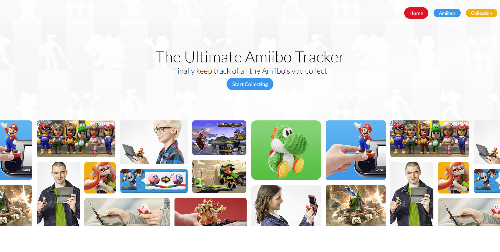

# My Amiibos

### A Amiibo collection webiste, Keep track of all your current and future amiibos!

My Amiibos allows you to track all your current and future amiibos with a quick click/tap. Simply search through all currently released amiibos and add them to your collection to see which ones you still have left to collect!

Once an amiibo is added to your collection. Viewing is as easy as clicking on the collection button and seeing exactly which amiibos have been collected.

#### Technologies

Vue Js
API: https://www.amiiboapi.com/

#### Features

- Search by type: Figures, Cards, or Yarn.
- Sort by: Game Series or name
- Or search for an amiibo directly.
- Click to add/remove an amiibo from your collection
- View your entire collection.

## Planned Features

- A way to login/logout to your own My Amiibo Collection account.
- Removing amiibos from your collection within the collection page.
- See which amiibos you haven't collected.
- Auto login/logout feature
- Ability to send your collection to your friends.
